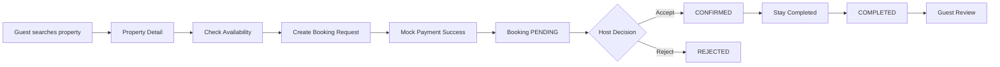
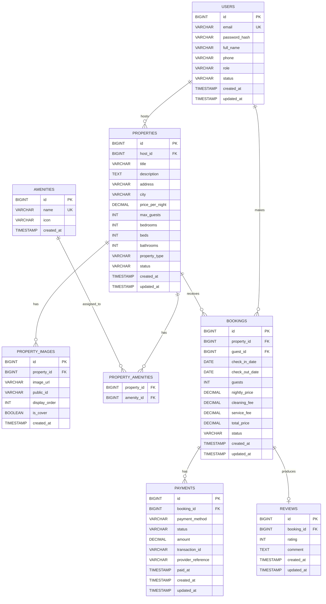
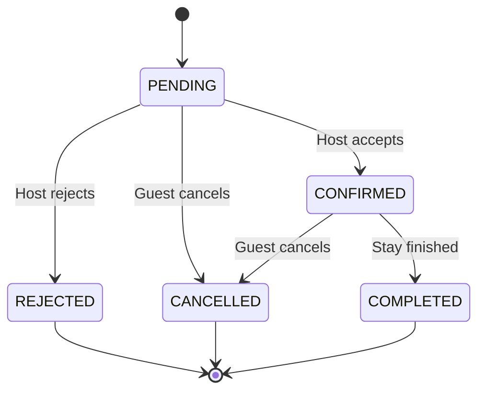
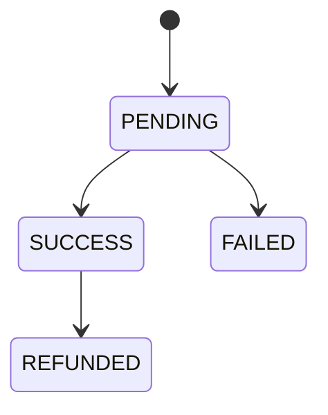
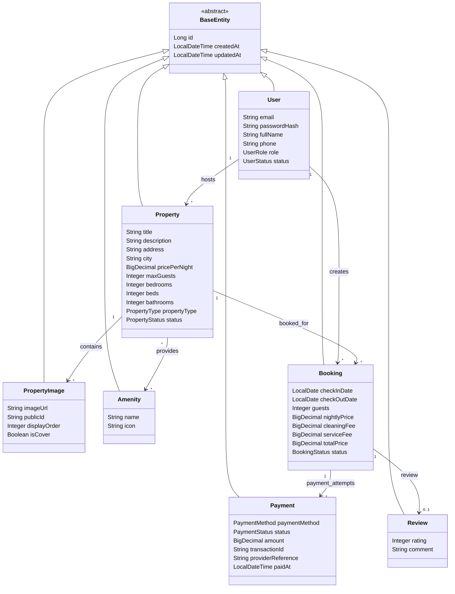
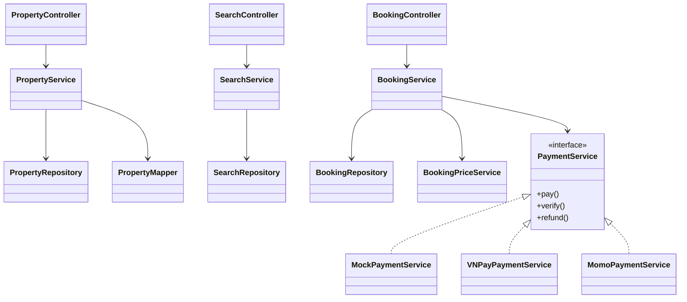
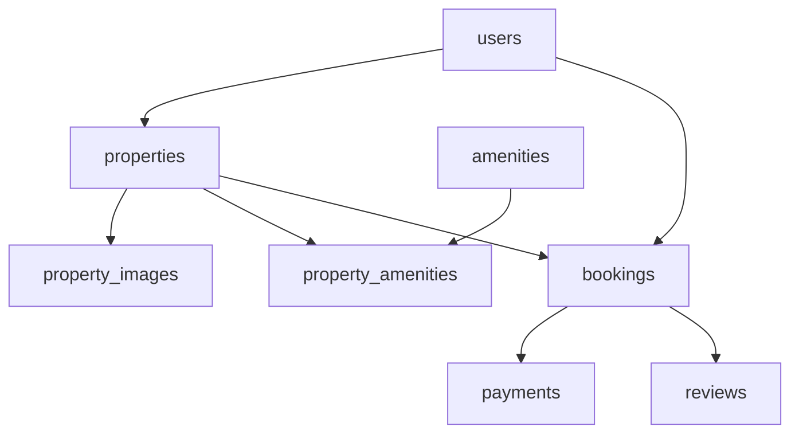
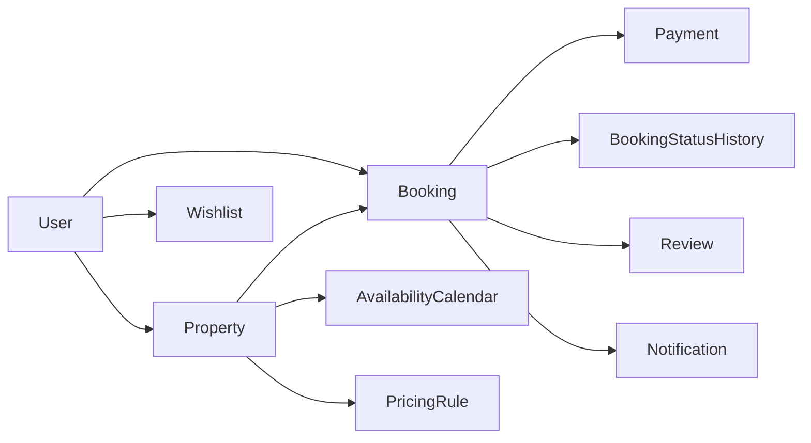

# StayHub — Database & Domain Design

> **Scope:** MVP architecture for a hotel/homestay booking platform based on the StayHub task list and planned modules: User/Auth, Property/Search/Host, Booking/Payment/Review, Notification, and Admin.
>
> **Database:** PostgreSQL  
> **ORM:** Spring Data JPA / Hibernate  
> **Migration:** Flyway  
> **Style:** Java monolith, MVC, feature-based package structure

---

# 1. Design Goals

The database is designed around the following MVP flow:



Main domain modules:

- **User/Auth**: registration, login, role management.
- **Property**: properties, images, amenities.
- **Search**: location/date/guest filtering.
- **Booking**: reservation lifecycle and availability checking.
- **Payment**: initially MOCK, later VNPay/MoMo.
- **Review**: review allowed only after a completed booking.
- **Notification**: initially email-based; can be expanded later.

---

# 2. Core ERD



---

# 3. Relational Data Model

## 3.1 `users`

The central identity table. A user may act as a **GUEST**, **HOST**, or **ADMIN**.

| Column | Type | Constraint | Description |
|---|---|---|---|
| id | BIGINT | PK | Primary key |
| email | VARCHAR(255) | NOT NULL, UNIQUE | Login email |
| password_hash | VARCHAR(255) | NOT NULL | BCrypt password hash |
| full_name | VARCHAR(150) | NOT NULL | User full name |
| phone | VARCHAR(30) | NULL | Contact phone |
| role | VARCHAR(20) | NOT NULL | GUEST / HOST / ADMIN |
| status | VARCHAR(20) | NOT NULL | ACTIVE / LOCKED / INACTIVE |
| created_at | TIMESTAMP | NOT NULL | Creation timestamp |
| updated_at | TIMESTAMP | NOT NULL | Last update |

Recommended constraints:

```sql
ALTER TABLE users
ADD CONSTRAINT chk_users_role
CHECK (role IN ('GUEST', 'HOST', 'ADMIN'));

ALTER TABLE users
ADD CONSTRAINT chk_users_status
CHECK (status IN ('ACTIVE', 'LOCKED', 'INACTIVE'));
```

### Relationships

```text
USER
 ├── 1:N → PROPERTY  (as HOST)
 └── 1:N → BOOKING   (as GUEST)
```

---

## 3.2 `properties`

Represents a hotel, homestay, apartment, villa, etc.

| Column | Type | Constraint | Description |
|---|---|---|---|
| id | BIGINT | PK | Property ID |
| host_id | BIGINT | FK → users.id | Property owner |
| title | VARCHAR(255) | NOT NULL | Property title |
| description | TEXT | NULL | Description |
| address | VARCHAR(500) | NULL | Detailed address |
| city | VARCHAR(100) | NOT NULL | Searchable city/location |
| price_per_night | DECIMAL(12,2) | NOT NULL | Base nightly price |
| max_guests | INT | NOT NULL | Maximum guests |
| bedrooms | INT | NOT NULL | Bedroom count |
| beds | INT | NOT NULL | Bed count |
| bathrooms | INT | NOT NULL | Bathroom count |
| property_type | VARCHAR(50) | NOT NULL | HOTEL / HOMESTAY / VILLA / APARTMENT |
| status | VARCHAR(20) | NOT NULL | ACTIVE / INACTIVE |
| created_at | TIMESTAMP | NOT NULL | Creation time |
| updated_at | TIMESTAMP | NOT NULL | Update time |

Relationship:

```text
USER (HOST) 1 -------- N PROPERTY
```

Recommended indexes:

```sql
CREATE INDEX idx_properties_host_id ON properties(host_id);
CREATE INDEX idx_properties_city ON properties(city);
CREATE INDEX idx_properties_price ON properties(price_per_night);
CREATE INDEX idx_properties_type ON properties(property_type);
```

---

## 3.3 `property_images`

Images are separated from `properties` because one property can have many images.

| Column | Type | Description |
|---|---|---|
| id | BIGINT PK | Image ID |
| property_id | BIGINT FK | Parent property |
| image_url | VARCHAR(1000) | Public image URL |
| public_id | VARCHAR(255) | Cloudinary/local storage identifier |
| display_order | INT | Gallery ordering |
| is_cover | BOOLEAN | Main property image |
| created_at | TIMESTAMP | Upload time |

Relationship:

```text
PROPERTY 1 -------- N PROPERTY_IMAGE
```

Example:

```text
Property: Da Nang Beach Villa

PROPERTY_IMAGES
├── beach-villa-cover.jpg     ← is_cover = true
├── bedroom-1.jpg
├── bedroom-2.jpg
├── swimming-pool.jpg
└── balcony.jpg
```

---

## 3.4 `amenities`

Master table containing reusable amenities.

| Column | Type | Description |
|---|---|---|
| id | BIGINT PK | Amenity ID |
| name | VARCHAR(100) UNIQUE | WiFi, Pool, Parking... |
| icon | VARCHAR(100) | Frontend icon identifier |
| created_at | TIMESTAMP | Creation time |

Examples:

```text
WiFi
Swimming Pool
Air Conditioning
Kitchen
Parking
TV
Breakfast
Washing Machine
```

---

## 3.5 `property_amenities`

This is a many-to-many bridge table.

```text
PROPERTY N -------- N AMENITY
```

Relational form:

```text
PROPERTY
   │
   │ 1:N
   ▼
PROPERTY_AMENITIES
   ▲
   │ N:1
   │
AMENITY
```

Schema:

| Column | Type | Constraint |
|---|---|---|
| property_id | BIGINT | FK → properties.id |
| amenity_id | BIGINT | FK → amenities.id |

Recommended primary key:

```sql
PRIMARY KEY (property_id, amenity_id)
```

---

# 4. Booking Domain

## 4.1 `bookings`

A booking connects:

```text
Guest
  │
  ▼
Booking
  │
  ▼
Property
```

Schema:

| Column | Type | Description |
|---|---|---|
| id | BIGINT PK | Booking ID |
| property_id | BIGINT FK | Booked property |
| guest_id | BIGINT FK | Guest making booking |
| check_in_date | DATE | Check-in |
| check_out_date | DATE | Check-out |
| guests | INT | Number of guests |
| nightly_price | DECIMAL(12,2) | Snapshot of nightly price |
| cleaning_fee | DECIMAL(12,2) | Cleaning fee |
| service_fee | DECIMAL(12,2) | Platform service fee |
| total_price | DECIMAL(12,2) | Final amount |
| status | VARCHAR(20) | Booking lifecycle |
| created_at | TIMESTAMP | Creation |
| updated_at | TIMESTAMP | Last update |

Important design decision:

> `nightly_price` should be stored inside the booking as a historical snapshot instead of recalculating from the current `properties.price_per_night`.

Otherwise:

```text
Day 1:
Property price = 1,000,000 VND
Guest creates booking

Day 10:
Host changes price = 1,500,000 VND

Old booking must still preserve:
1,000,000 VND
```

---

# 5. Booking Status State Diagram



Recommended enum:

```java
public enum BookingStatus {
    PENDING,
    CONFIRMED,
    CANCELLED,
    REJECTED,
    COMPLETED
}
```

---

# 6. Availability and Date Overlap

A property is unavailable when an existing active booking overlaps the requested date range.

Overlap condition:

```text
existing.check_in < requested.check_out
AND
existing.check_out > requested.check_in
```

Example:

```text
Existing booking:
May 10 ─────────────── May 15

Request A:
May 12 ───── May 14        ❌ OVERLAP

Request B:
May 15 ───── May 18        ✅ AVAILABLE
```

Repository query concept:

```sql
SELECT COUNT(*)
FROM bookings b
WHERE b.property_id = :propertyId
  AND b.status IN ('PENDING', 'CONFIRMED')
  AND b.check_in_date < :checkOut
  AND b.check_out_date > :checkIn;
```

For an MVP this query is sufficient. Later, PostgreSQL range types and exclusion constraints can be considered for stronger database-level protection.

---

# 7. Payment Domain

## 7.1 `payments`

| Column | Type | Description |
|---|---|---|
| id | BIGINT PK | Payment ID |
| booking_id | BIGINT FK | Related booking |
| payment_method | VARCHAR(20) | MOCK / VNPAY / MOMO |
| status | VARCHAR(20) | PENDING / SUCCESS / FAILED / REFUNDED |
| amount | DECIMAL(12,2) | Paid amount |
| transaction_id | VARCHAR(255) | Internal transaction identifier |
| provider_reference | VARCHAR(255) | VNPay/MoMo reference |
| paid_at | TIMESTAMP | Successful payment time |
| created_at | TIMESTAMP | Creation |
| updated_at | TIMESTAMP | Update |

Payment relationship:

```text
BOOKING 1 -------- N PAYMENT
```

Why 1:N instead of strict 1:1?

Because future payment scenarios may include:

```text
Payment attempt #1 → FAILED
Payment attempt #2 → SUCCESS
Refund transaction  → REFUNDED
```

Therefore:

```text
BOOKING
   │
   ├── PAYMENT #1 FAILED
   └── PAYMENT #2 SUCCESS
```

For the MVP, the application can enforce one successful payment per booking.

Payment state:



---

# 8. Review Domain

## 8.1 `reviews`

A review is tied to a completed booking.

| Column | Type | Description |
|---|---|---|
| id | BIGINT PK | Review ID |
| booking_id | BIGINT FK UNIQUE | One review per booking |
| rating | INT | 1–5 |
| comment | TEXT | Guest comment |
| created_at | TIMESTAMP | Creation |
| updated_at | TIMESTAMP | Update |

Relationship:

```text
BOOKING 1 -------- 0..1 REVIEW
```

Recommended rule:

```sql
CHECK (rating BETWEEN 1 AND 5)
```

Application rule:

```text
Only:
BOOKING.status = COMPLETED

can create:
REVIEW
```

---

# 9. Full Relational Overview

```text
┌────────────────┐
│     USERS      │
├────────────────┤
│ id PK          │
│ email UNIQUE   │
│ password_hash  │
│ full_name      │
│ phone          │
│ role           │
│ status         │
└───────┬────────┘
        │
        │ HOST
        │ 1:N
        ▼
┌────────────────┐       ┌─────────────────────┐
│   PROPERTIES   │──1:N──│   PROPERTY_IMAGES   │
├────────────────┤       └─────────────────────┘
│ id PK          │
│ host_id FK     │───┐
│ title          │   │
│ city           │   │
│ price_per_night│   │
└───────┬────────┘   │
        │            │
        │ N:N        │
        ▼            │
┌────────────────────┐
│ PROPERTY_AMENITIES │
└─────────┬──────────┘
          │
          ▼
    ┌────────────┐
    │ AMENITIES  │
    └────────────┘


USERS (Guest)
      │
      │ 1:N
      ▼
┌────────────────┐
│    BOOKINGS    │─────────1:N─────────┐
├────────────────┤                     │
│ property_id FK │                     ▼
│ guest_id FK    │              ┌──────────────┐
│ check_in       │              │   PAYMENTS   │
│ check_out      │              └──────────────┘
│ total_price    │
│ status         │
└───────┬────────┘
        │
        │ 1:0..1
        ▼
┌────────────────┐
│    REVIEWS     │
└────────────────┘
```

---

# 10. Java Entity Class Diagram



---

# 11. Suggested JPA Relationships

## User

```java
@Entity
@Table(name = "users")
public class User extends BaseEntity {

    @Column(nullable = false, unique = true)
    private String email;

    @Column(name = "password_hash", nullable = false)
    private String passwordHash;

    @Enumerated(EnumType.STRING)
    private UserRole role;

    @OneToMany(mappedBy = "host")
    private List<Property> hostedProperties = new ArrayList<>();

    @OneToMany(mappedBy = "guest")
    private List<Booking> bookings = new ArrayList<>();
}
```

## Property

```java
@Entity
@Table(name = "properties")
public class Property extends BaseEntity {

    @ManyToOne(fetch = FetchType.LAZY, optional = false)
    @JoinColumn(name = "host_id")
    private User host;

    @OneToMany(
        mappedBy = "property",
        cascade = CascadeType.ALL,
        orphanRemoval = true
    )
    private List<PropertyImage> images = new ArrayList<>();

    @ManyToMany
    @JoinTable(
        name = "property_amenities",
        joinColumns = @JoinColumn(name = "property_id"),
        inverseJoinColumns = @JoinColumn(name = "amenity_id")
    )
    private Set<Amenity> amenities = new HashSet<>();
}
```

## Booking

```java
@Entity
@Table(name = "bookings")
public class Booking extends BaseEntity {

    @ManyToOne(fetch = FetchType.LAZY)
    @JoinColumn(name = "property_id", nullable = false)
    private Property property;

    @ManyToOne(fetch = FetchType.LAZY)
    @JoinColumn(name = "guest_id", nullable = false)
    private User guest;

    @Enumerated(EnumType.STRING)
    private BookingStatus status;

    @OneToMany(mappedBy = "booking")
    private List<Payment> payments = new ArrayList<>();

    @OneToOne(mappedBy = "booking")
    private Review review;
}
```

## Payment

```java
@Entity
@Table(name = "payments")
public class Payment extends BaseEntity {

    @ManyToOne(fetch = FetchType.LAZY)
    @JoinColumn(name = "booking_id", nullable = false)
    private Booking booking;

    @Enumerated(EnumType.STRING)
    private PaymentMethod paymentMethod;

    @Enumerated(EnumType.STRING)
    private PaymentStatus status;
}
```

## Review

```java
@Entity
@Table(name = "reviews")
public class Review extends BaseEntity {

    @OneToOne(fetch = FetchType.LAZY)
    @JoinColumn(name = "booking_id", unique = true, nullable = false)
    private Booking booking;

    @Column(nullable = false)
    private Integer rating;

    @Column(columnDefinition = "TEXT")
    private String comment;
}
```

---

# 12. Service / Domain Class Relationships



---

# 13. Recommended Enums

## UserRole

```java
public enum UserRole {
    GUEST,
    HOST,
    ADMIN
}
```

## UserStatus

```java
public enum UserStatus {
    ACTIVE,
    LOCKED,
    INACTIVE
}
```

## PropertyType

```java
public enum PropertyType {
    HOTEL,
    HOMESTAY,
    VILLA,
    APARTMENT
}
```

## PropertyStatus

```java
public enum PropertyStatus {
    ACTIVE,
    INACTIVE
}
```

## BookingStatus

```java
public enum BookingStatus {
    PENDING,
    CONFIRMED,
    CANCELLED,
    REJECTED,
    COMPLETED
}
```

## PaymentMethod

```java
public enum PaymentMethod {
    MOCK,
    VNPAY,
    MOMO
}
```

## PaymentStatus

```java
public enum PaymentStatus {
    PENDING,
    SUCCESS,
    FAILED,
    REFUNDED
}
```

---

# 14. Suggested Flyway Migration Order

```text
V1__create_users.sql
V2__create_properties.sql
V3__create_property_images.sql
V4__create_amenities.sql
V5__create_property_amenities.sql
V6__create_bookings.sql
V7__create_payments.sql
V8__create_reviews.sql
```

Alternative grouping for the current MVP:

```text
V1__create_users.sql
V2__create_properties.sql
    ├── properties
    ├── property_images
    ├── amenities
    └── property_amenities

V3__create_bookings.sql

V4__create_payments.sql

V5__create_reviews.sql
```

The second approach aligns well with the current planned project tasks.

---

# 15. Database Dependency Order



This order should also be respected by Flyway migrations.

---

# 16. MVP Database Rules

## User Rules

- `email` must be unique.
- Password is stored only as `password_hash`.
- Role controls authorization.
- A HOST is still a user; a separate `hosts` table is unnecessary for the MVP.

## Property Rules

- Every property belongs to exactly one host.
- One property can have multiple images.
- Exactly zero or one image should be marked as the cover image.
- Property amenities use a many-to-many relationship.

## Booking Rules

- `check_in_date < check_out_date`.
- `guests <= property.max_guests`.
- A guest cannot create an overlapping active booking for the same property.
- Booking price is a historical snapshot.
- Only valid state transitions are allowed.

## Payment Rules

- A payment belongs to one booking.
- Multiple payment attempts may exist.
- Only successful payment should allow the MVP booking creation flow to continue.
- `amount` should match the booking's final payable amount.

## Review Rules

- A booking can have at most one review.
- Only `COMPLETED` bookings can be reviewed.
- Rating must be between 1 and 5.

---

# 17. Future Extensions

The current MVP intentionally avoids unnecessary complexity. Recommended post-MVP additions:

```text
users
├── wishlist_items
├── notifications
└── user_addresses

properties
├── availability_calendar
├── pricing_rules
├── property_rules
└── room_types

bookings
├── guests
├── cancellation_history
└── booking_status_history

payments
├── refunds
└── payment_webhooks
```

A useful next-level architecture would be:



---

# 18. Final MVP Recommendation

For the current StayHub MVP, the recommended core relational model is:

```text
USERS
  │
  ├──< PROPERTIES
  │       │
  │       ├──< PROPERTY_IMAGES
  │       └──< PROPERTY_AMENITIES >── AMENITIES
  │
  └──< BOOKINGS >── PROPERTIES
           │
           ├──< PAYMENTS
           │
           └─── REVIEW
```

This design keeps the MVP:

- simple enough for a student/team project;
- normalized enough to avoid duplicated data;
- compatible with Spring Data JPA;
- easy to migrate with Flyway;
- extensible for Cloudinary, VNPay, MoMo, wishlist, notifications, and advanced availability later.

---

# 19. Recommended Documentation Files

This document can later be split into:

```text
docs/
├── database-design.md
├── erd.md
├── booking-state-machine.md
├── api-contract.md
└── architecture.md
```

For the current project stage, a single `database-design.md` is sufficient.
