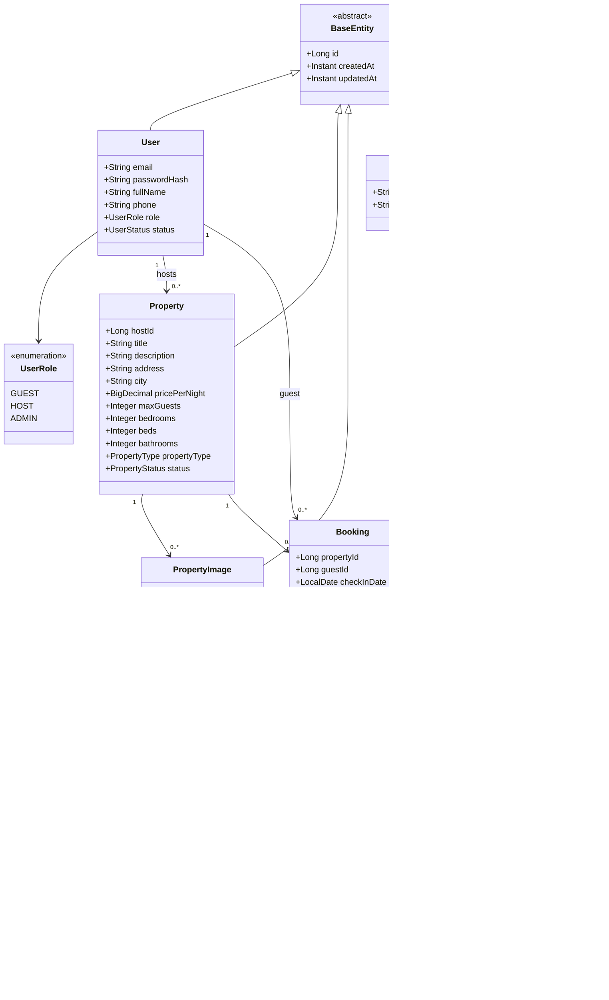

```mermaid
classDiagram

    class BaseEntity {
        <<abstract>>
        +Long id
        +Instant createdAt
        +Instant updatedAt
    }

    class User {
        +String email
        +String passwordHash
        +String fullName
        +String phone
        +UserRole role
        +UserStatus status
    }

    class Property {
        +Long hostId
        +String title
        +String description
        +String address
        +String city
        +BigDecimal pricePerNight
        +Integer maxGuests
        +Integer bedrooms
        +Integer beds
        +Integer bathrooms
        +PropertyType propertyType
        +PropertyStatus status
    }

    class PropertyImage {
        +String imageUrl
        +String publicId
        +Integer displayOrder
        +Boolean isCover
    }

    class Amenity {
        +String name
        +String icon
    }

    class Booking {
        +Long propertyId
        +Long guestId
        +LocalDate checkInDate
        +LocalDate checkOutDate
        +Integer guests
        +BigDecimal nightlyPrice
        +BigDecimal cleaningFee
        +BigDecimal serviceFee
        +BigDecimal totalPrice
        +BookingStatus status
    }

    class Payment {
        +Long bookingId
        +PaymentMethod paymentMethod
        +PaymentStatus status
        +BigDecimal amount
        +String transactionId
        +Instant paidAt
    }

    class Review {
        +Long bookingId
        +Long propertyId
        +Long guestId
        +Integer rating
        +String comment
    }

    class UserRole {
        <<enumeration>>
        GUEST
        HOST
        ADMIN
    }

    class BookingStatus {
        <<enumeration>>
        PENDING
        CONFIRMED
        CANCELLED
        REJECTED
        COMPLETED
    }

    class PaymentMethod {
        <<enumeration>>
        MOCK
        VNPAY
        MOMO
    }

    class PaymentStatus {
        <<enumeration>>
        PENDING
        SUCCESS
        FAILED
        REFUNDED
    }

    BaseEntity <|-- User
    BaseEntity <|-- Property
    BaseEntity <|-- PropertyImage
    BaseEntity <|-- Amenity
    BaseEntity <|-- Booking
    BaseEntity <|-- Payment
    BaseEntity <|-- Review

    User --> UserRole
    Booking --> BookingStatus
    Payment --> PaymentMethod
    Payment --> PaymentStatus

    User "1" --> "0..*" Property : hosts
    User "1" --> "0..*" Booking : guest
    Property "1" --> "0..*" PropertyImage
    Property "1" --> "0..*" Booking
    Booking "1" --> "1" Payment
    Booking "1" --> "0..1" Review
```