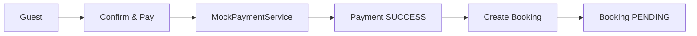

# Payment


| Column | Type | Constraint | Description |
|---|---|---|---|
| `id` | BIGINT | PK | Payment identifier |
| `booking_id` | BIGINT | FK, UNIQUE | Related booking |
| `payment_method` | VARCHAR(20) | NOT NULL | `MOCK`, `VNPAY`, `MOMO` |
| `status` | VARCHAR(20) | NOT NULL | Payment state |
| `amount` | NUMERIC(12,2) | NOT NULL | Payment amount |
| `transaction_id` | VARCHAR(255) | UNIQUE | Gateway transaction reference |
| `paid_at` | TIMESTAMPTZ | NULL | Success time |
| `created_at` | TIMESTAMPTZ | NOT NULL | Creation timestamp |
| `updated_at` | TIMESTAMPTZ | NOT NULL | Last update timestamp |

## Payment states

```text
PENDING
SUCCESS
FAILED
REFUNDED
```

## MVP relationship



### Recommended business sequence

```text
1. Validate request
2. Check property availability
3. Calculate price
4. Create/perform payment
5. If payment SUCCESS:
      create booking with PENDING
6. Return booking confirmation
```
